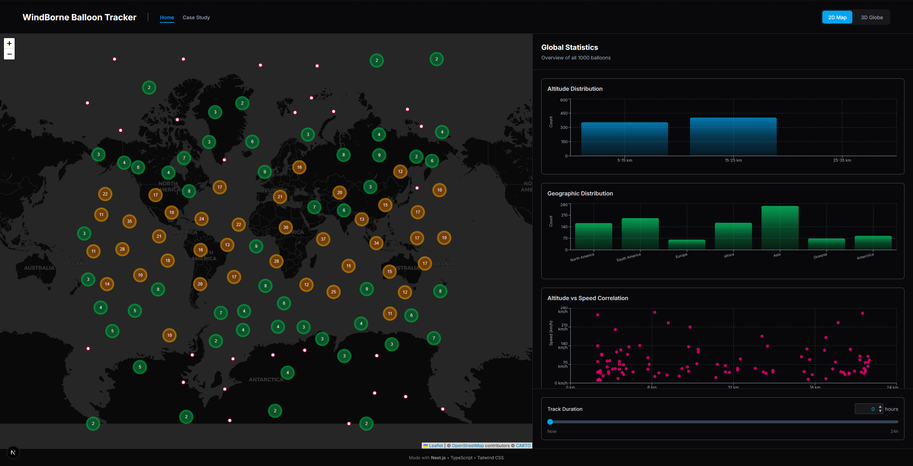
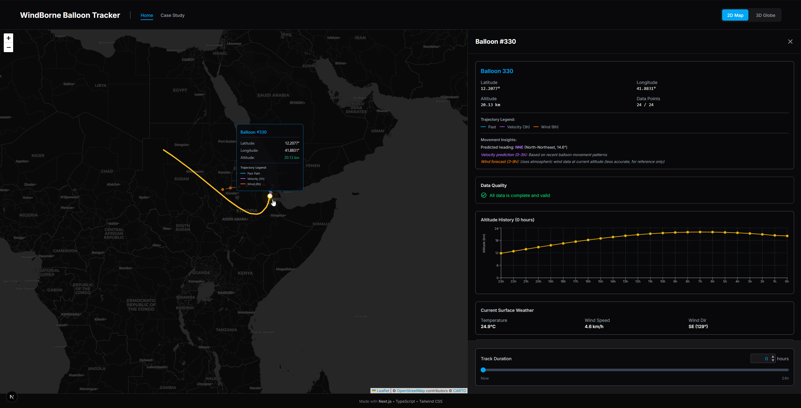
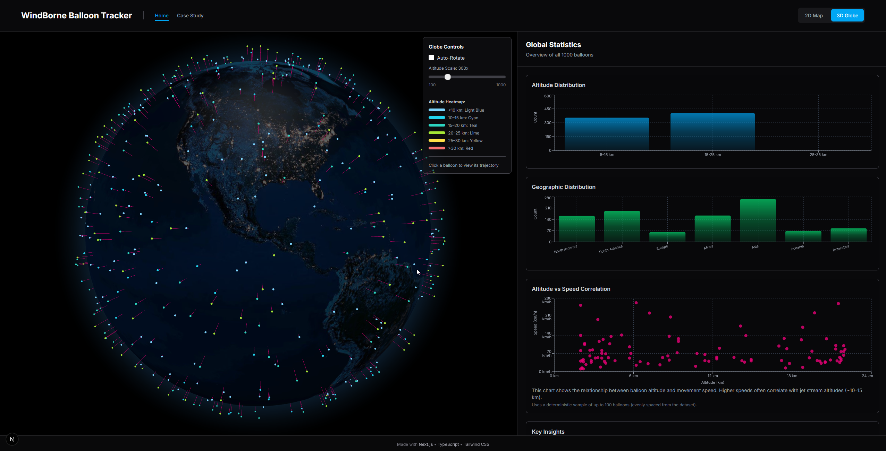
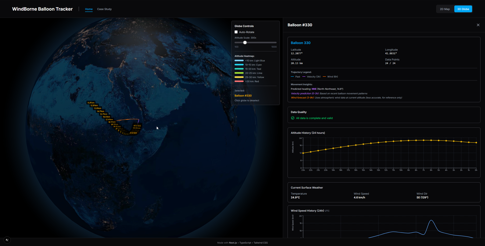

# WindBorne Balloon Tracker

This project was built as part of the WindBorne Junior Web Developer challenge.  
The goal was to explore their live telemetry feed, work through the rough parts of the data,  
and combine it with an external weather source to create an interactive visualization that  
is easy to explore in both 2D and 3D.

A real-time visualization tool that shows the WindBorne balloon constellation in 2D and 3D.  
The project takes the live telemetry feed, handles the messy parts of the data, and adds  
external weather information to help explain how the balloons move. The aim was to build  
something that feels simple to navigate and gives a clear sense of what the constellation  
is doing at any moment.

**Live Demo:**
https://windborne-challenge.jisnugm.com

## Screenshots

### 2D Mode View

*2D mode, with same details panel showing global statistic.*

### 2D Map View with Trajectory

*2D map visualization with historical trajectory and future predictions.*

### 3D Globe View with Altitude Heatmap

*Interactive 3D globe showing balloon constellation with altitude-based color coding.*

### 3D Balloon Details View

*Single-balloon view on the 3D globe, showing its recent path, predicted trajectory, movement insights, altitude history, and local weather data.*


## Features

- Switch between an interactive 2D map and a 3D globe
- Real-time tracking of more than a thousand active balloons
- 24 hour historical playback with a smooth time slider
- Short term trajectory prediction based on recent movement
- Extended prediction using Open-Meteo wind data
- Wind misalignment checks to compare observed motion vs forecasted winds
- Altitude based color coding with simple, readable bands
- Data quality checks to handle the gaps or corrupted samples
- Global statistics and per balloon insights

## Tech Stack

- Next.js 15 with TypeScript
- Tailwind CSS for layout and styling
- Leaflet for 2D mapping
- react-globe.gl for 3D visualization
- Recharts for charts and statistics
- Open-Meteo API for wind and weather data

## Getting Started

Install dependencies:

```bash
npm install
```

Run the development server:

```bash
npm run dev
```

Open http://localhost:3000 to view the application.

## Project Structure

- `/app` – Next.js app directory with routes, layout, and page logic  
- `/components` – UI components and visualization elements  
- `/lib` – Data fetching, helpers, and shared types  

## Data Sources

- **WindBorne Systems API** – Live balloon positions and hourly history  
- **Open-Meteo API** – High altitude wind and weather forecasts
